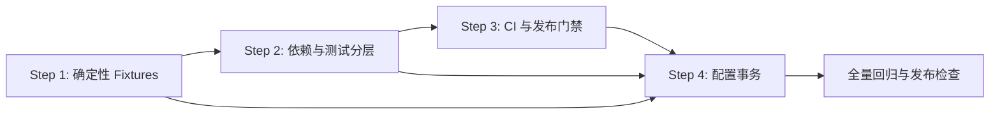
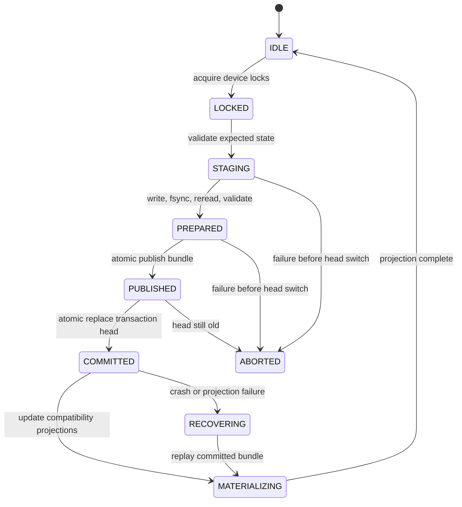

# Stage 7.1.10 开发基线稳定化详设

状态：实施中。本文冻结实施边界、接口和验收标准，不授权改写既有 Stage 1 至 Stage 6 历史证据。

日期：2026-07-23

实施状态（2026-07-23）：

- Step 1 的通用 fixture loader、manifest 校验器、配置引用闭包和 Stage 1 设备模型已经完成；
  Stage 2.1、Stage 3.1、Stage 4 冻结上游及 Stage 4.0 candidate 的原始历史字节无法从 Git、本机
  工作区或备份恢复。项目负责人已批准建立 successor rebaseline；当前已生成可重算的开发基线闭包，
  保留旧 `FROZEN_RECEIPT` 预期哈希并将旧字节标为 `unavailable`。successor 状态固定为
  `pending_production_selector`，并已由独立 reviewer 批准用于 hosted CI development baseline；该批准
  明确不宣称 Stage 2.1 至 4.0 物理 evidence 已重新执行，也不授权 production selector；
- Step 2 的 CPython 3.12 Windows/Linux test lock、四层 marker、authority drift 和完整收集已经完成；
  Windows 已完成含 hash 的安装模拟，Linux lock 必须由 Linux CI 独立验证；
- Step 3 的 PR、夜间物理、hosted evidence 和 release workflow 文件已经实现；旧 v1 Notebook replay
  只允许显式 self-hosted 环境。GitHub Ruleset 尚未把资格 jobs 设为 required，也未取得连续 7 次
  稳定运行，因此“workflow 已实现”不等于“required 门禁已成立”；
- Step 4 未实施。进入条件中的 Step 3 required 门禁及事务 schema vector 独立审查尚未成立，当前
  仍为 NO-GO，详见 `docs/reviews/2026-07-23-configuration-transaction-entry-check-and-fault-injection-matrix.md`。

## 0. 结论摘要

下一轮开发按以下四步串行建立可信基线：

1. 将测试对本机、被 Git 忽略的 `output/` 的依赖迁移为仓库内确定性 fixtures；
2. 补齐测试依赖和锁文件，将 1473 项测试分成 contract、integration、physics_slow、evidence；
3. 建立干净 clone 上可复现的 Windows 必选 CI，以及 Linux 补充、夜间物理和发布证据门禁；
4. 将配置保存、候选应用、快照、Active、pin 和 audit 统一到可恢复的文件事务中。

四步不是四个互不相关的优化。第一步提供确定性输入，第二步定义执行环境和测试语义，第三步把
前两步变成每次合并都必须满足的门禁，第四步才在可信门禁下改造高风险持久化路径。



项目经理综合四个独立 AI 任务的只读评审后作出以下架构决策：

- `output/` 继续整体 Git ignore，不提交用户实验、实时配置、日志或 SQLite；
- 历史 evidence 环境与当前开发测试环境分开，旧 Stage 5/6 lock 和冻结 fixture 不原地改写；
- Windows/CPython 3.12.10 是现阶段规范资格平台，Linux 用于发现跨平台问题；
- 配置事务新增独立 `transactions/heads/<device>.json` 提交头，不复用
  `active/<device>.json`；Active 继续只表达实验生效快照；
- SQLite 不作为配置 authority；事务 authority 仍是可校验、不可变的 canonical JSON；
- 配置保存成功后仍立即生效，不增加用户手工“应用”步骤。

## 1. 当前问题基线

### 1.1 测试与工作区

2026-07-23 在当前 `dev` 分支的只读审查结果：

- pytest 可收集 1473 项测试；
- 一组覆盖主链路的 597 项执行结果为 `594 passed, 3 failed`，耗时 394.21 秒；
- 三项失败均来自 `tests/test_experiment_storage_references.py`；
- 该文件第 21 行固定旧 run ID，第 26 行复制
  `ROOT / "output" / "platform-configurations"`；
- 当前本机配置已指向另一 run，测试结果会随用户配置变化；
- `.gitignore` 第 18 行忽略 `output/`，`git ls-files output` 为空；
- 仓库当前没有 `.github/workflows`。

因此，当前“本机多数通过”不能等价于“干净 clone 可复现”。即使把本机测试修绿，换一台机器仍会
因为 `output/` 不存在、Notebook kernel 依赖缺失或历史 authority 环境不匹配而失败。

### 1.2 依赖缺口

`pyproject.toml` 的 `dev` extra 目前只有 `pytest>=7.4`。但：

- `tests/test_control_channel_compatibility.py` 顶层导入 `NotebookClient`；
- 同一测试会通过 `jupyter_client.kernelspec` 启动 `python3` kernel；
- `src/sqvm/control/compatibility.py` 要求 `nbclient==0.10.2`；
- 同一模块还把批准解释器固定为
  `C:\Users\fandaojin\anaconda3\python.exe`，GitHub-hosted Windows runner 无法满足；
- 两个 Stage lock 都没有声明 `nbclient`、`jupyter-client`、`ipykernel`；
- 修改 `pyproject.toml` 会改变 Stage 2 source digest，并影响后续 source snapshot。

所以本轮依赖修复不能只在某台开发机中 `pip install`，也不能为了增加 extra 直接触发全链 authority
漂移。本详设选择独立 test lock 和独立 pytest 配置，稳定化阶段不修改 `pyproject.toml`。

### 1.3 配置写入缺口

`src/sqvm/web/configuration.py` 当前存在以下跨文件半完成窗口：

- `update_current_configuration()` 先写 current 和 audit，再创建、激活快照；
- `apply_candidates_to_current_configuration()` 同样先改变 current，再建快照；
- `snapshot_current_configuration()` 依次写 snapshot、source candidate、pin、current、audit、Active；
- `apply_snapshot_to_current()` 先改 current，再决定激活原快照或创建新快照；
- `_atomic_json()` 只对一个文件执行临时文件、`fsync` 和 `os.replace`，未形成跨文件提交点；
- Web 使用线程服务器，Web 与 Notebook 也可能是两个进程，当前没有每设备事务锁；
- 快照会写 `source_candidate.json`，但 `snapshot()`/`snapshots()` 没有从侧车读回，恢复快照可能
  丢失候选来源。

## 2. 总体目标与非目标

### 2.1 目标

1. 全新 clone、不存在仓库根 `output/` 时，确定性测试可运行；
2. 开发者和 CI 使用同一套可重建依赖；
3. 每项测试的成本、平台、证据等级和失败含义明确；
4. PR 在合并前至少通过 Windows 干净环境的确定性门禁；
5. 真实 QuTiP、Notebook 历史证据和长任务不再伪装成快速测试；
6. 配置写入在进程终止、磁盘错误、Windows sharing violation 和并发请求下只呈现完整旧代或完整
   新代；
7. 用户在 Web 首页保存有效配置后立即生效；
8. 当前 `/api/v1` 主要响应字段、PlatformConfiguration v0.2 内容和既有历史快照继续可读；
9. 每个工作包有实现者、交叉审查者和独立验收证据。

### 2.2 非目标

1. 本轮不修改 QCIS、波形、Hamiltonian、QuTiP 算法或校准实验原理；
2. 不将用户 `output/` 纳入 Git；
3. 不把历史 Stage 5/6 lock 升级成当前开发 lock；
4. 不重新宣称旧 evidence 已在新环境中复现；
5. 不引入网络数据库、对象存储、分布式锁或多用户权限；
6. 不在 CI 自动生成并覆盖冻结 evidence；
7. 不用自动重试掩盖真实 QuTiP 超时或数值失败；
8. 不在事务提交失败时擅自选择“最新快照”恢复。

## 3. 全局不变量

四步实施中必须始终满足：

1. **正式数据隔离**：测试只写 `tmp_path` 或 CI 临时根，不修改用户 `output/`；
2. **旧证据不可变**：历史 fixture、批准记录、Stage 5/6 lock 的原始字节保持不变；
3. **哈希按最终字节计算**：不得手填占位 SHA 后将其作为通过证据；
4. **未知即失败**：未知 fixture schema、marker、事务 manifest 或 authority version fail closed；
5. **无静默跳过**：门禁要求的依赖、Node、kernel、fixture 缺失时任务失败，不用 skip 报绿；
6. **物理声明分级**：fake/contract 通过不能表达真实物理演化通过；
7. **提交点唯一**：配置事务只有 transaction head 切换一个提交点；
8. **提交后不回滚**：提交头已切换的事务只能恢复或由新事务反向修改，不能删除新代伪装失败；
9. **相对路径封闭**：fixture 和事务 manifest 只能引用受信根内的规范相对路径，不跟随链接；
10. **审查可追踪**：每个工作包记录输入 commit、命令、结果、实现者和独立审查者。

## 4. Step 1：确定性 Fixtures

### 4.1 目标边界

该步骤不是把当前 `output/` 复制进 Git，而是按验证器真正需要的最小证据闭包，构造可提交、可重放、
不含用户状态的 fixture 包。

优先迁移已确认的依赖：

| 领域 | 现有依赖 | 新 fixture |
| --- | --- | --- |
| 配置引用图 | 本机 `output/platform-configurations` | `platform_configuration_reference_v1` |
| Stage 1 设备模型 | 本机 device artifacts | `device_model_v1` |
| Stage 2.1 rebaseline | 本机 rebaseline approval/manifest | `stage21_rebaseline_v1` |
| Stage 3 solver gate | 本机 validation/approval | `solver_validation_v1` |
| Stage 3.1 控制信号 | 本机控制工件 | `stage31_control_signal_v1` |
| Stage 4 冻结上游 | 历史 `output` 和源码 SHA 闭包 | `stage4_frozen_upstream_v1` |
| Stage 4.0 控制候选 | 本机 manifest/notebook/report | `stage40_control_channel_candidate_v1` |
| Runtime v0.2 | 已有正确先例 | 保留 `runtime_v02_legacy_v1` |

### 4.2 目录布局

```text
tests/
  fixtures/
    platform_configuration_reference_v1/
      provenance.json
      platform-configurations/
        current/demo_2q1c2r.json
        active/demo_2q1c2r.json
        snapshots/<fixed-snapshot-id>/snapshot.json
        snapshots/<fixed-snapshot-id>/source_candidate.json
        audit/<fixed-event-id>.json
    device_model_v1/
      provenance.json
      device_artifacts.json
    stage21_rebaseline_v1/
      provenance.json
      rebaseline_manifest.json
      rebaseline_approval.json
    solver_validation_v1/
      provenance.json
      dense_pilot.json
      eigsh_validation.json
      eigsh_validation_approval.json
    stage31_control_signal_v1/
      provenance.json
      ...minimum accepted artifacts...
    stage4_frozen_upstream_v1/
      provenance.json
      repository-root/
        output/...minimum frozen receipt closure...
        configs/...hash-bound inputs...
        docs/...hash-bound approvals...
        src/...hash-bound historical source subset...
    stage40_control_channel_candidate_v1/
      provenance.json
      control_channel_manifest.json
      verification.ipynb
      verification_report.json
  support/
    fixture_loader.py
  tools/
    generate_<fixture>_fixture.py
    verify_fixture_manifest.py
```

Stage 4 fixture 使用隔离的 `repository-root`。原因是其冻结收据同时绑定历史 `output`、配置、文档和
源树；只复制几个 JSON、再让验证器读取当前工作区源码，会产生虚假的混合代际。

### 4.3 Fixture manifest

每个 `provenance.json` 至少包含：

```json
{
  "schema_version": "0.1",
  "fixture_id": "platform_configuration_reference_v1",
  "generator_version": "0.1",
  "generator_raw_sha256": "...",
  "source_authority": "synthetic_minimal_closure",
  "fixed_clock_utc": "2026-07-16T00:00:00.000000Z",
  "files": [
    {"path": "platform-configurations/current/demo_2q1c2r.json", "byte_length": 0, "raw_sha256": "..."}
  ],
  "aggregate_sha256": "..."
}
```

规则：

- `files` 按 POSIX 相对路径排序；
- `aggregate_sha256` 对不含 `provenance.json` 自身的规范文件清单计算，避免自引用；
- 新生成的合成 fixture JSON 使用 UTF-8、LF、canonical JSON；历史字节回放 fixture 必须保留原始
  编码、空白和换行，并按原始字节计算 SHA。Stage 4 冻结收据中的 `device_artifact` 与
  `previous_stage2_artifact` 是明确的 non-canonical 例外，不得重序列化；
- UUID、run ID、recommendation ID、snapshot ID、event ID、时钟、主机名和 PID 均固定；
- fixture 中的引用必须构成闭包，manifest 校验后再做领域 schema 校验；
- 生成器必须支持 `--verify-against`，生成到外部临时目录并逐字节对比，不原地覆盖。

配置引用 fixture 固定使用一个 applied candidate 闭包即可：一个 current、一个 snapshot、一个 Active、
一个 source candidate 和一个 applied audit。不得复制当前包含草稿、多快照和用户审计历史的整棵目录。

### 4.4 生成与人工维护边界

生成器负责：

- 注入固定身份和时钟；
- 生成最小合法对象；
- 计算内容哈希、文件原始哈希和 aggregate；
- 复读并调用真实 loader/verifier；
- 在目标已存在或工作区不干净时拒绝覆盖。

人工负责：

- 决定 fixture 语义、版本和预期结果；
- 审查最小闭包中每个文件为何存在；
- 批准历史 fixture 的整体升级；
- 保持预期断言独立于生产实现，避免“同一函数生成、同一函数验证”的循环证明。

大多数变体由 `tests/support/fixture_loader.py` 将黄金 fixture 复制到 `tmp_path` 后修改。只有需要
逐字节历史回放的黄金对象进入 `tests/fixtures`。

### 4.5 禁止提交的内容

- 完整本机 `output/`；
- 真实实验扫描数组、图片、日志和用户注释；
- 实时 current、draft、pin 和审计历史；
- SQLite、WAL、SHM、缓存和 lock；
- 临时 staging、trash、archive 或 orphan 目录；
- 绝对路径、真实用户名、主机名和不稳定环境快照；
- 验证器不读取的大型冗余文件。

### 4.6 迁移与验收

1. 先实现通用 loader、manifest verifier 和配置引用 fixture；
2. 替换 `test_experiment_storage_references.py` 及相邻 storage 测试的本机目录复制；
3. 按 Stage 1、Stage 2.1、Stage 3、Stage 3.1 迁移领域 fixture；
4. 最后迁移 Stage 4 隔离历史 repository fixture 和独立 Stage 4.0 candidate fixture；
5. 删除测试中的仓库根 `output/` 直接读取；
6. CI 从不存在 `output/` 的 clean checkout 运行；
7. 为 content hash、Active hash、audit、duplicate key、NaN、额外文件、缺文件、symlink、junction、
   hardlink 分别保留 fail-closed 篡改测试。

Step 1 的 DoD：

- `git ls-files output` 为空；
- 所有 fixture manifest 可独立复算；
- 任何 fixture 篡改只发生在复制到 `tmp_path`/CI 临时根的副本；其他测试产物也只能写临时根；
- fast/integration 套件不读取仓库根 `output/`；
- 当前三项 storage reference 失败在 clean clone 中通过；
- 历史 evidence fixture 缺失时明确失败，不回退本机数据。

## 5. Step 2：依赖锁与测试分层

### 5.1 环境分离

定义三类环境，禁止混用：

| 环境 | 用途 | Authority |
| --- | --- | --- |
| runtime | 用户安装和普通 API | `pyproject.toml` runtime dependencies |
| current-test | 当前 contract/integration/physics 开发与 CI | `requirements-test-py312-lock.txt` + `pytest.ini` |
| historical-evidence | 旧 Stage 5/6 和字节级回放 | 既有 stage lock + fixture provenance |

`requirements-stage5-lock.txt` 和 `requirements-stage6-lock.txt` 保持原字节不变。新增当前测试 lock，
不能用“修改旧 lock”代替环境升级。

### 5.2 测试依赖入口设计

本轮不修改 `pyproject.toml`，也不新增 `[test]` extra。原因是它的原始字节同时参与 Stage 2 source
digest、Stage 5.1 source snapshot 和 Stage 6 provenance；为了一个开发依赖入口触发整条物理 evidence
重批，收益不足以覆盖风险。

新增 `requirements-test-py312.in` 和 `requirements-test-py312-lock.txt`。输入必须显式包含
`pyproject.toml` 当前全部 runtime 依赖（numpy、scipy、pyyaml、nbformat、matplotlib、qutip）以及测试
依赖，形成可支持 `pip install -e . --no-deps` 的完整环境。测试依赖至少直接声明：

- pytest；
- `nbclient==0.10.2`；
- jupyter-client；
- ipykernel；
- 当前测试确实导入的其他测试工具。

现有 `.[dev]` 保留为历史最小入口，但 README 明确说明它不足以运行完整测试；规范开发安装命令是先
从 hash lock 安装，再执行 `pip install -e . --no-deps`。Notebook-only 依赖不得在普通
`import sqvm` 时启动 kernel；能够延迟导入的生产路径改为局部导入并给出明确缺依赖错误。

新增根级 `pytest.ini` 注册 marker、`testpaths` 和 `pythonpath`。pytest 会优先读取该文件，因此无需
改动 `pyproject.toml` 中参与 authority 的原始字节。旧配置暂时保留，待未来正式 rebaseline 后再去重。

新增 `requirements-test-py312-lock.txt`：

- 基于 CPython 3.12.10 生成；
- 固定直接和传递依赖；
- 包含下载哈希，并用 `pip install --require-hashes` 验证；
- 包含 kernel 实际链路，如 jupyter-core、traitlets、pyzmq、tornado、IPython；
- 包含 runtime 与 test 的全部传递依赖；CI 增加 drift check，若 `pyproject.toml` runtime 列表和 input
  不一致则直接失败；
- 哈希集合必须同时支持目标 Windows 和 Linux wheel/sdist；若单一 lock 无法安全覆盖两个平台，则由
  同一 input 生成 `requirements-test-py312-windows-lock.txt` 与 `...-linux-lock.txt`，并分别 clean install；
- 文件头记录生成命令、Python 版本和输入 SHA；
- 依赖升级只能经显式 lock regeneration 和测试 approval。

### 5.3 Authority 与 Notebook 环境处理

Step 2 的原始验收必须证明 `pyproject.toml` raw SHA、`stage2_model_source_tree_sha256()`、Stage 5.1
`source_snapshot_v1.json`、Stage 6 旧 lock/fixture 均未改变。该验收完成后，项目负责人因历史 evidence
字节不可恢复而另行批准 successor rebaseline 工作包；新增的 CI development baseline 是独立 v2
候选链，不修改上述 v1 字节，也不激活 production selector。

Stage 4 Notebook v1 分成两类验证：

- GitHub-hosted Windows 只验证冻结文件 raw hash、schema、`nbclient==0.10.2` 约束和“不匹配解释器时
  fail closed”，不宣称执行过历史 Notebook；
- 真实 v1 Notebook 执行只能在同时具备批准绝对解释器、批准 kernelspec 和批准包版本的原环境或
  明确标记的 self-hosted runner 上运行；无该 runner 时不把这项列为普通 PR/发布 required；
- 测试 lock 中的普通 kernel smoke 只证明当前开发环境能启动 kernel，不冒充 Stage 4 v1 evidence。

未来如需在 GitHub-hosted runner 真实执行 Stage 4 Notebook，必须单独设计
`stage4_notebook_runtime_v2`：用版本化 policy 绑定 Python 版本、平台、test lock SHA、host interpreter
与 kernelspec `argv[0]` 同一性及 argv tail，取消个人绝对路径；随后产生 v2 manifest、report、独立
approval 和显式 current selector。v1 代码、fixture、approval 和解释器路径继续只服务历史重放。

如果未来仍决定修改 `pyproject.toml`，则必须另立 NO-GO successor 工作包，按顺序生成并批准：

1. Stage 2 source identity v2 与 Stage 2.1 rebaseline manifest/approval v2；
2. 绑定 v2 Stage 2 的 Stage 3/3.1 readiness、verification 和 approval v2；
3. Stage 4 upstream receipt、Notebook runtime policy、candidate、review、approval v2；
4. 当前 Stage 5.1 source snapshot 与 Stage 6 source/environment provenance successor；
5. 版本化 registry/selector，只让新运行选择 v2，旧 artifact 继续选择 v1；
6. 由非实现者从隔离目录执行生成、verify、tamper、old-byte-match，再允许切换 current selector。

上述六项不属于本轮四步的隐含工作，不能以更新硬编码测试 SHA 代替。

### 5.4 Pytest 主分类

每项测试必须有且仅有一个主 marker：

| Marker | 定义 | 目标预算 | 默认平台 |
| --- | --- | ---: | --- |
| `contract` | 纯解析、schema、模型、QCIS、小型 hash/validation；不启动服务或真实求解 | 5 分钟内 | Windows + Linux |
| `integration` | 临时文件系统、SQLite、Web、archive、subprocess、前端合同 | 12 分钟内 | Windows 必选，Linux 补充 |
| `physics_slow` | 实际进入 QuTiP/高维演化的有界任务 | 单 job 60 分钟内 | Windows 资格，Linux 诊断 |
| `evidence` | 冻结 authority、Notebook、历史 replay、byte-match、rebaseline | 单 job 60 分钟内 | 固定批准环境 |

可叠加辅助 marker：

- `release`：发布前必须执行的 evidence 子集；
- `windows`：只在 Windows 有资格含义；
- `notebook`：需要 kernelspec；
- `node`：需要项目固定的 Node 版本；
- `link_privilege`：需要创建链接或特定权限；
- `destructive_fixture`：会在隔离 checkout 临时改写 authority 后恢复，禁止并行。
- `legacy_environment`：只能在历史批准解释器/平台执行，不进入 hosted runner required 集合。

不允许把一个测试仅因“文件名看起来像物理测试”自动分类。marker 应在测试定义处显式，
`--strict-markers` 必须开启。

### 5.5 套件规则

`contract`：

- 不访问仓库根 `output/`；
- 不访问网络；
- 不启动 Notebook、Node、Web server 或真实 QuTiP worker；
- 所有时钟、UUID 和随机数固定；
- 单测试应尽量小于 1 秒，超预算需拆分或升级分类。

`integration`：

- 只使用 `tmp_path`/临时端口；
- 服务必须在测试结束时关闭；
- 数据库存放临时根，不读取用户 catalog；
- 可运行 fake backend 和小型 subprocess；
- frontend 合同缺 Node 时在 required job 中失败，而不是 skip。

`physics_slow`：

- 只跑已批准的 bounded smoke/校准规格，不运行被代码明确禁止的 formal-scale 配置；
- BLAS/OpenMP 线程数固定，避免 runner 过度并行；
- CI worker timeout 与 GitHub job timeout 分开配置，初始单 worker 上限采用 900 秒，job 上限 60 分钟；
- timeout 失败保留诊断且不得自动重试成绿色；
- fake 结果不得进入该 marker。

`evidence`：

- 串行、隔离 checkout；
- 使用 fixture provenance 指定的精确环境；
- 临时改写任何 tracked authority 前后均检查 Git diff；
- 生成器只能 compare，不自动覆盖仓库 fixture；
- Linux 不承担 Windows 历史 fixture 的资格声明。
- hosted runner 使用 `evidence and release and not legacy_environment`；v1 Notebook 真实执行只能由显式
  self-hosted job 选择 `legacy_environment`，两者结果不得混写。

### 5.6 测试结构整理

当前多个测试模块从其他 `test_*.py` 导入私有 helper。迁移为：

```text
tests/support/
  contexts.py
  calibration_requests.py
  synthetic_runners.py
  fixture_loader.py
```

支持代码自身不以 `test_` 命名，类型和副作用明确。这样按单文件、marker 或 shard 运行时不会依赖
pytest 的偶然导入顺序。

### 5.7 验收

- `pytest --collect-only -q --strict-markers` 仍收集 1473 项；
- 四个主 marker 的并集为 1473，交集为空；
- 从测试 lock 安装后，普通 `python3` kernelspec 可真实启动；历史 Stage 4 v1 在非批准解释器上稳定
  fail closed，且不被报告为已执行通过；
- 普通 `import sqvm` 不要求启动 Notebook runtime；
- `pyproject.toml` raw SHA、Stage 2 source digest、Stage 5.1 source snapshot 和 Stage 6 历史 identity 不变；
- 旧 Stage 5/6 lock 和 runtime v0.2 fixture raw SHA 不变；
- contract 和 integration 在 clean clone、不存在 `output/` 时通过；
- README 明确列出安装、四套命令和声明边界。

## 6. Step 3：CI 与发布门禁

### 6.1 Workflow 拆分

建议新增四个 workflow：

```text
.github/workflows/
  ci-pr.yml
  ci-nightly-physics.yml
  ci-evidence.yml
  ci-release.yml
```

### 6.2 `ci-pr.yml`

触发：

- pull request 到 `dev` 或 `main`；
- push 到 `dev` 或 `main`；
- concurrency 按 PR/ref 分组，`cancel-in-progress: true`；
- 默认权限仅 `contents: read`。

Jobs：

| Job | 平台 | 初始门禁 | 内容 |
| --- | --- | --- | --- |
| `fixture-integrity` | Windows | required | manifest、路径、hash、aggregate、无根 output 依赖 |
| `contract-windows` | Windows Server | required | 精确 Python/lock、compile、contract |
| `integration-windows` | Windows Server | advisory 后转 required | integration、事务故障注入、Web/API |
| `contract-linux` | Ubuntu | supplemental | 同一 contract，发现大小写/路径/平台差异 |
| `integration-linux` | Ubuntu | supplemental | 临时文件系统、SQLite、事务和 Web 的跨平台路径 |

`integration-windows` 在 Step 1/2 完成后的前 7 次连续成功中先作为 advisory；P95 在 12 分钟预算内且
无 flaky 后升级 required。Linux 初期不阻断合并，但失败必须形成 issue，不能长期忽略。

每个 clean job 的顺序：

1. checkout，普通测试使用浅 clone；历史 evidence 才使用完整历史；
2. 安装 CPython 3.12.10；
3. 断言 `output/` 不存在，且 `git ls-files output` 为空；
4. 通过 hash lock 安装依赖，再 `pip install -e . --no-deps`；
5. `pip check`；
6. `python -m compileall -q src tests/support`；
7. fixture manifest verifier；
8. 对应 pytest marker，启用 `-p no:cacheprovider`、JUnit 和 `--durations`；
9. 断言 tracked 文件没有变化；
10. `if: always()` 上传 JUnit、环境指纹和受控日志。

缓存只缓存 pip 下载/wheel，以 OS、Python 精确版本、lock SHA 和 `pyproject.toml` SHA 为键。禁止缓存
`.venv`、`output/`、SQLite、pytest cache、实验结果或冻结 evidence。

Ruff 不在第一天用默认规则阻断整个历史仓库。先以固定版本生成只读报告；当选定规则在现有代码上
归零后，再把 `ruff check` 和 `ruff format --check` 升为 required，避免稳定化工作包夹带全库格式化。

### 6.3 `ci-nightly-physics.yml`

触发：每天定时、`workflow_dispatch` 和 `workflow_call`。被 release workflow 调用时必须 checkout 调用者
传入的精确 candidate SHA，不解析“最新分支”。

- `physics-windows`：规范资格平台；
- `physics-linux`：补充诊断；
- 单进程运行 `physics_slow`；
- job timeout 初始 60 分钟，单 worker timeout 初始 900 秒；
- 固定 BLAS/OpenMP 线程数为 1；
- 不自动重试 `WORKER_TIMEOUT`；
- 失败时上传 stdout/stderr、JUnit、环境指纹和明确白名单内的 staging 诊断；
- 不上传完整用户 `output/`；
- 只声明 bounded physical smoke 结果，不声明 formal-scale 资格。

### 6.4 `ci-evidence.yml`

触发：手工、定时低频和 `workflow_call`。被 release workflow 调用时使用同一 candidate SHA。

Jobs：

- `historical-fixture-byte-match`：在 hosted Windows 上校验已提交 fixture 清单和原始字节；需要历史
  writer 的逐字节再生成时使用其 provenance 指定的固定环境；
- `stage4-v1-byte-contract`：在 hosted Windows 验证冻结 hash/schema 和解释器不匹配时 fail closed，
  不执行 Notebook；
- `stage4-v1-notebook-execution`：只在带 `stage4-v1-approved-environment` 标签的 self-hosted runner 手工
  运行；普通 release 不依赖该 job，也不把它的缺席显示为通过；
- `historical-output-regression`：只允许使用仓库 fixture 或经 SHA 校验的受控 artifact 包，并解压到
  一次性隔离 checkout；
- `authority-drift-check`：核对 `pyproject.toml`、旧 lock、fixture、approval 和 source snapshot 没有被
  本轮稳定化改动漂移。

证据任务发现输入缺失或 hash 不匹配时失败。不得下载未知“最近成功”的 output 包补齐，也不得
自动更新 golden files。

### 6.5 `ci-release.yml`

触发：

- `pull_request` 到 `main`；
- `workflow_dispatch`，要求显式 `candidate_sha`；
- 不使用“最近一次其他 workflow 成功”作为当前候选的替代证据。

`ci-release.yml` 在同一 workflow run 内以 reusable workflow 调用 physics 和 hosted evidence，所有 checkout
显式使用 PR `head.sha` 或手工输入的 candidate SHA。最终固定汇总 job 名为
`release-gate-main`，只有所有 `needs` job 对同一 SHA 成功时才返回 0。

依赖：

- 当前 commit 的 required PR jobs 已通过；
- 最近一次同 commit physics Windows 通过；
- hosted `evidence and release and not legacy_environment` 通过；
- 工作树/fixture/authority drift 检查通过；
- 生成一份只含命令、commit、环境、测试计数和 artifact hash 的 release summary。

手工触发时先验证 `candidate_sha` 是目标分支可达的完整 commit；summary、JUnit 和 environment receipt
都写入同一 SHA。任何 called workflow 被取消、跳过或返回其他 SHA，`release-gate-main` 必须失败。

### 6.6 分支保护

对 `dev` 首先要求：

- `fixture-integrity`；
- `contract-windows`；
- 分支与目标最新；
- 所有会话已解决。

`integration-windows` 达到稳定预算后加入 required。`main` Ruleset 额外要求固定状态
`ci-release / release-gate-main`；该状态由 PR 到 `main` 自动产生，不能由手工、夜间或其他 commit
的成功记录替代。Linux contract/integration 保持 supplemental，待连续稳定且平台含义明确后再决定
是否 required。

### 6.7 失败处置

| 失败 | 处置 |
| --- | --- |
| fixture hash/byte mismatch | 阻断；判断是受控版本升级还是篡改，不自动生成 |
| clean clone 读取 `output/` | 阻断；迁移为 fixture，不在 CI 创建假 output 掩盖 |
| kernel 缺失/版本不符 | required job 失败；修 lock/kernelspec |
| Windows sharing violation | 保留注入点和日志；只有已定义瞬时错误可在发布原语内有界重试 |
| QuTiP timeout | 失败并保留诊断；先基准分析，不自动重试 |
| Linux-only 失败 | 创建平台问题并跟踪；不把 Windows 资格结论扩展到 Linux |
| 测试改动 tracked authority | 阻断并隔离测试；不得仅在 finally 里希望恢复 |

## 7. Step 4：配置崩溃一致性事务

### 7.1 关键架构决策

团队评审提出过“扩展 `active/<device>.json` 作为提交头”的方案。项目经理决定采用独立 transaction
head，原因如下：

1. Active 是领域对象，只表示实验使用哪个快照；保存 pin 或 audit 可能不改变 Active；
2. `src/sqvm/storage/references.py` 对 Active v0.2 使用严格字段集合，增加事务字段会破坏现有验证；
3. 独立 head 可以保持 PlatformConfiguration v0.2 和 Active pointer 原字节/语义兼容；
4. transaction head 是存储一致性 authority，不应混成物理/校准 authority；
5. 未来事务版本升级不会迫使 QCIS/实验 context 改 Active schema。

SQLite 不作为事务 authority。配置对象需要进入实验 provenance 和引用图，canonical JSON 更适合独立
校验、复制和长期兼容。SQLite 只能作为未来可重建的查询投影。

### 7.2 文件布局

```text
output/platform-configurations/
  transactions/
    heads/
      <device_id>.json
    bundles/
      <device_id>/<operation_id>/
        manifest.json
        receipt.json
        state/
          current.json
          active.json                 # 未初始化设备可缺省，manifest 中 active_ref=null
          snapshot_catalog.json
          pin_catalog.json
          audit_head.json
          idempotency_catalog.json
        objects/
          snapshots/<snapshot_id>/snapshot.json
          snapshots/<snapshot_id>/source_candidate.json
          audit/<event_id>.json
    staging/
      <device_id>/<operation_id>/...
    legacy-global/
      <import_id>/manifest.json
      <import_id>/audit/...
    quarantine/
    locks/
      <device_id>.lock
  current/                       # 兼容投影，head 存在后不再是事务 authority
  active/                        # 兼容投影；内容仍是原 Active v0.2
  snapshots/                     # 兼容投影
  pins/                          # 兼容投影
  audit/                         # 兼容投影
  drafts/                        # 本轮不改变草稿语义
```

`bundles/<device>/<operation_id>` 是不可变、已 durable publish 的事务对象。v0.1 规定客户端
`operation_id` 同时是该设备内的 transaction ID；内部操作也先生成 UUID4 operation ID。只有该 bundle
位于当前 head 的可验证 parent manifest 链中才算 committed。既不在提交链、也不在当前 catalog 的
bundle 是 orphan，不能自行成为当前状态。

### 7.3 Head 与 manifest

Head 最小字段：

```json
{
  "schema_version": "0.1",
  "artifact_type": "platform_configuration_transaction_head",
  "device_id": "demo_2q1c2r",
  "generation": 12,
  "transaction_id": "<operation_id>",
  "manifest_path": "transactions/bundles/demo_2q1c2r/<operation_id>/manifest.json",
  "manifest_raw_sha256": "...",
  "parent_transaction_id": "...",
  "parent_manifest_raw_sha256": "...",
  "committed_utc": "..."
}
```

Manifest 至少绑定：

- transaction/operation ID、device ID、generation、operation type；
- `operation_id`、request canonical SHA；
- parent transaction ID、parent manifest path/raw SHA；初代使用显式 `null`；
- expected current content SHA 和 expected revision；
- current、Active、snapshot catalog、pin catalog、audit head 的相对路径、byte length、raw SHA；
- idempotency catalog 与 `receipt.json` 的相对路径、byte length、raw SHA；
- 新 snapshot/source candidate/audit 对象清单；
- manifest schema、writer version 和 created UTC；
- aggregate SHA。

所有路径必须相对配置根，拒绝 `..`、绝对路径、重复规范化路径、symlink、junction、reparse point 和
hardlink。Head、manifest、catalog 和对象逐层复核 hash。

提交链和幂等规则：

- 每个 manifest 以可寻址 parent transaction ID 和 parent manifest SHA 形成不可变单链；
- 当前 head 只能指向 generation 比 parent 大 1 的 manifest；环、断链、generation 跳变均 fail closed；
- `idempotency_catalog.json` 是当前 generation 的完整 operation 索引，记录 operation ID、request SHA、
  transaction/receipt 相对路径与 raw SHA；v0.1 不自动裁剪；
- `receipt.json` 保存该操作首次提交时的稳定公开结果身份，后续状态已变化时仍返回原 receipt，并附
  `superseded=true`，不能伪装成最新 current；
- 重试先通过 `<device>/<operation_id>` 定位 bundle，再要求它存在于当前 parent 链和 idempotency
  catalog；只有两者都成立才认定已提交；
- 已 publish 但不在链中的同 ID bundle只能在 request SHA、parent manifest 和 expected state 仍完全
  一致时继续提交，否则隔离；
- orphan/GC 判定必须遍历当前 head chain、snapshot/pin/audit/idempotency catalogs，不能只看目录名。

### 7.4 状态机



语义：

- Head 切换前失败：新事务对读者不可见，旧代完整有效；
- Head 切换后失败：新事务已经提交，恢复必须向前完成；
- `committed` 不依赖额外 `committed.json`，避免产生第二提交点；
- compatibility projection 的失败不会回滚 head；
- old-or-new 保证适用于所有官方 head-aware reader；平铺 projection 是非权威导出，不在该保证内；
- 物理删除和自动快照清理不在主事务提交路径中。

### 7.5 锁与并发

每设备使用两层锁：

1. 进程内 `threading.RLock`，处理 ThreadingHTTPServer 并允许受控内部调用；
2. 跨进程 advisory file lock，处理 Web、Notebook 和其他 Python 进程。

实现使用标准库平台原语封装：Windows 文件锁与 POSIX `flock`，不采用仅凭 lock 文件存在判断的
永久锁。锁文件可含诊断元数据，但所有权由 OS handle 决定。

锁覆盖：恢复、读取 head、expected hash 校验、构造、publish、head switch 和第一次 projection。
默认有界等待 5 秒，超时返回 `503 configuration_transaction_busy` 与 `Retry-After`。

并发规则：

- 两个请求携带同一 expected hash 时，只有先获得锁者提交；后者重新读取 head 后返回 409；
- 不同设备可并行；
- 同一 `operation_id + request_sha` 重试通过 manifest chain + idempotency catalog 返回原 receipt；
- 同一 operation ID 配不同 request SHA 返回 409；
- 读请求使用“读 head -> 校验 bundle -> 再读 head”的乐观一致读取；head 变化则重试，超过上限取锁。

### 7.6 统一事务入口

以下写路径统一调用内部 `_commit_configuration_transaction()`：

- `update_current_configuration()`；
- `initialize_current_calibration()`；
- `apply_candidates_to_current_configuration()`；
- `snapshot_current_configuration()`；
- `apply_snapshot_to_current()`；
- `set_active()`；
- `set_keep()`。

逻辑伪流程：

```text
commit(operation, device, operation_id, expected_state, transform):
  acquire device locks
  recover_if_needed(device)
  old = load_committed_generation_or_legacy(device)
  verify expected hash/revision, parent manifest and idempotency catalog
  new = transform(deep_copy(old))
  validate current + active + snapshots + source candidates + catalogs
  write canonical bundle, receipt and next idempotency catalog to staging
  fsync every file and directory; reread and verify manifest
  atomic_publish(staging, bundles/device/operation_id)
  atomically replace and directory-flush heads/device.json   # 唯一提交点
  materialize legacy projections idempotently
  record health/projection state
  return committed generation and public response
```

复用 `src/sqvm/runtime/storage.py` 已有的 same-volume 检查、tree flush、原子 no-replace 目录发布和
Windows directory flush；复用 `src/sqvm/runtime/publication.py` 只对明确的 Windows 瞬时 rename 错误
做有界重试。普通 schema/permission/disk-full/hash 错误不得重试。

### 7.7 Current、Snapshot、Active 和候选来源语义

- 用户保存有效 current 时，同一事务构造 published snapshot 和新 Active，因此保存成功立即生效；
- 候选应用在同一事务中保存 current、snapshot、Active、source candidate 和 audit；
- 单独“保存快照但不激活”仍提交新 current/snapshot catalog，但 Active 内容保持旧值；
- 恢复 experiment-eligible 快照时，同一事务更新 current 和 Active；
- 恢复不 eligible 的历史快照时，按现有产品语义发布一个新 eligible snapshot，再将它设为 Active；
- `source_candidate.json` 是快照对象的一部分，manifest 单独绑定其 raw SHA；
- 新 `snapshot()`/`snapshots()` 从 head catalog 加载侧车；legacy 模式也必须读取已有侧车；
- Active resolver 从 transaction head 指向的 `state/active.json` 和 snapshot catalog 解析同代对象；
- transaction head 只保证一致性，不改变 snapshot content SHA 或实验 provenance 中的 Active 身份。

官方读取边界：

- `ConfigurationManagementStore`、`PlatformConfigurationResolver`、storage reference graph、Web 和
  Notebook/Python API 全部迁移为 head-aware reader，事务切换前以静态检索和 integration test 证明它们
  不直接读取平铺投影；
- `current/active/snapshots/pins/audit` 平铺目录只作兼容投影，可能在崩溃后短暂处于不同 materialization
  进度，不承诺跨文件原子；任何继续直接读这些路径的外部脚本不属于事务保证；
- 为仍需旧布局的脚本提供 `export_legacy_generation(device_id, generation, target)`，从同一 manifest 构造
  完整 legacy-shaped staging 目录后原子发布；脚本应读取该不可变导出，而不是 live projection；
- projection 每项带根外受控的 generation receipt；官方 health 可报告 `pending/complete/failed`，但官方
  reader 永远不以 projection 补齐 transaction bundle；
- 切换 transaction head authority 前，文档、README 和 API 对直接文件读取给出废弃说明。

### 7.8 Audit 与 pin

- 每个写操作只产生一个主 audit event，event ID 在 staging 前确定；
- `audit_head.json` 记录当前事件、前一事件 raw SHA，形成 append-only hash chain；
- pin catalog 是该 generation 的完整逻辑 pin 状态，`pins/` 只是兼容投影；
- `set_keep` 也是事务，即使 Active 不变也切换 transaction head；
- snapshot prune 先通过新事务从 catalog 移除可清理项，再异步物理 GC；
- GC 失败只产生 health 告警，不改变已提交状态；
- 被 current、Active、pin、parent、source candidate 或引用图保护的对象不得回收。

### 7.9 启动恢复与 legacy migration

Store 初始化和每次写入前执行恢复。首次迁移先持有全局 bootstrap lock，再按 device ID 排序获取设备
锁，并完成以下严格 inventory：

1. 枚举 allowlist 内全部 `current/*.json`、`active/*.json`、
   `snapshots/<id>/snapshot.json`、可选 `source_candidate.json`、`pins/*.json` 和 `audit/*.json`；
2. 拒绝未知文件、链接、重复 ID、目录名/对象 ID 不一致、dangling pin、无法归属的 snapshot、hash/schema
   错误和同 ID 不同字节；
3. 按 snapshot/current payload 的 device ID 分组；pin 通过 snapshot ID 归组；audit 通过 details 中的
   device/snapshot 绑定归组；无法归属但 schema 合法的旧 draft/global audit 逐字节复制到 hash-bound
   `legacy-global/<import_id>`，不丢弃；
4. 对每个设备将 current、全部历史 snapshot、全部 source candidate、pin、audit 原始字节复制进
   `legacy_import` bundle；catalog 只引用 bundle 内不可变路径，并记录 legacy path、byte length/raw SHA；
5. Active 存在时严格验证目标 snapshot 和 content SHA；无 Active 只允许合法的未初始化管理状态，导入
   `active_ref=null`，runtime resolver 继续返回 unavailable；
6. 为每个设备构造 generation 0 manifest、snapshot/pin/audit/idempotency catalog 和 import receipt，逐项
   对比导入前后的数量、ID 和 raw SHA；
7. durable publish 所有 bundle 后按设备切换 head；若中途崩溃，启动恢复根据 bootstrap inventory/receipt
   完成剩余设备，同一设备绝不混用两种来源；
8. 保留原 legacy 文件作为非权威投影，不立即删除；某设备一旦有 head，该设备任何读失败都不得回退
   legacy 文件。全局列表在返回前必须确保 inventory 中所有设备均迁移完成。

旧数据不一致时：

- 不自动选最新快照；
- 不改写原文件；
- 隔离未提交 staging/orphan 到 quarantine；
- 返回 `503 configuration_recovery_required`；
- health 输出稳定错误码、device ID、transaction ID，不泄露任意系统路径。

Head 已指向完整 bundle、但 projection 未完成时，恢复幂等重放新代。Head 未切换的完整 bundle 仍是
候选 orphan，只有在 parent chain、bootstrap receipt、snapshot/pin/audit/idempotency catalog 均确认无
引用后才清理。迁移后的 `snapshot()`、audit list 和 reference graph 只读取 bundle/catalog，不引用保留
的 legacy projection。

### 7.10 API 语义

写请求增加 `operation_id`，Web 自动生成，Notebook/Python API 可显式传入。保留现有 expected content
SHA 乐观并发条件。

| 场景 | HTTP/结果 |
| --- | --- |
| 校验失败 | 422，未提交 |
| expected hash/revision 过期 | 409 `stale_configuration` |
| operation ID 被不同请求复用 | 409 `idempotency_conflict` |
| 锁超时 | 503 `configuration_transaction_busy` |
| head 切换前 I/O 失败 | 500 `configuration_transaction_aborted`，旧代仍有效 |
| head 已切换、projection 待恢复 | 优先 200/201，带 `projection_status=pending`；无法构造响应时返回 503 `configuration_committed_recovery_pending` 和 transaction ID |
| head/manifest 损坏 | 503 `configuration_recovery_required`，禁止实验使用 |

成功响应新增非破坏字段：

```json
{
  "transaction": {
    "transaction_id": "...",
    "operation_id": "...",
    "generation": 12,
    "durability_status": "committed",
    "projection_status": "complete"
  }
}
```

客户端遇到 `configuration_committed_recovery_pending` 时，使用相同 operation ID 查询/重试，不能以新
operation ID 重复应用候选。

### 7.11 故障注入矩阵

| 注入点 | 重启后必须看到 |
| --- | --- |
| 任一 staged JSON 打开/写入/fsync 前后 | 完整旧代 |
| source candidate、pin、audit 写入失败 | 完整旧代 |
| manifest 生成或复读校验失败 | 完整旧代，staging 可隔离 |
| bundle 原子 publish 前/中 | 完整旧代 |
| bundle publish 后、head 前 | 完整旧代，bundle 为 orphan |
| head 临时文件写入/fsync 失败 | 完整旧代 |
| `os.replace(head)` 前 | 完整旧代 |
| `os.replace(head)` 后立即 kill | 完整新代，启动后向前恢复 |
| parent directory flush 后 kill | 完整新代 |
| current/Active/snapshot/pin/audit projection 失败 | 新代有效，projection 可重放 |
| GC/prune 失败 | 新代有效，无受保护对象被删 |
| Windows sharing violation | 有界重试或明确失败，绝不混代 |
| 磁盘满/权限错误 | 提交点前旧代；提交点后新代待恢复 |
| 两个同 expected hash 并发写 | 恰一成功，另一 409 |
| 同 operation ID 响应丢失后重试 | 返回同一 transaction，不重复写 |
| 已提交旧 operation ID 在若干新代后重试 | parent chain/index 证明后返回原 receipt，标记 superseded |
| 伪造孤儿 bundle 使用已提交 operation ID | 不在 chain/index，拒绝或隔离 |
| source candidate 缺失/hash 不符 | fail closed，不恢复成无来源候选 |
| head 指向不存在/链接 bundle | 503 recovery required |

故障测试既包含函数级注入，也包含 subprocess 强制终止，随后重新构造 Store 验证磁盘事实。

### 7.12 Step 4 验收

- 每个 cut point 重启后，所有官方 head-aware reader 返回的 current、Active、snapshot、source candidate、
  pin、audit 全部来自旧代或新代；compatibility projection 恢复后最终收敛到新代；
- `resolve_active_context()` 始终解析完整旧快照或完整新快照；
- Web 保存后立即运行新配置，不需第二次启用；
- 候选来源 candidate IDs、targets、run/recommendation 在快照恢复后不丢失；
- 两个进程并发写不会丢更新；
- 事务恢复幂等，连续恢复三次字节和 generation 不变；
- legacy 全部 snapshot/source candidate/pin/audit 原始字节无损导入；未知、冲突、悬空数据 fail closed；
- 最新和非最新 operation ID 重试均由 chain/index 证明并返回同一 receipt；孤儿不能冒充 committed；
- storage reference graph 在 head 存在时只认 committed generation，不把 orphan/projection 重复计入；
- Windows 与 Linux integration 均通过，Windows sharing violation 场景通过；
- 当前 API 主字段兼容，新增事务字段有 contract test。

## 8. 四步实施顺序与工作包

| WP | 内容 | 前置 | 主要产物 | 合并门禁 |
| --- | --- | --- | --- | --- |
| WP1-A | 通用 fixture loader/manifest | 无 | support + verifier | manifest 篡改测试 |
| WP1-B | 配置引用 fixture 迁移 | WP1-A | 最小 applied closure | storage reference 全绿 |
| WP1-C | Stage 1-3.1 fixture 迁移 | WP1-A | 领域 fixtures | 无根 output 依赖 |
| WP1-D | Stage 4 隔离历史 fixture | WP1-A | frozen repo closure | byte/hash replay |
| WP2-A | hash test lock 与 pytest 入口 | WP1 基本完成 | test input/lock + `pytest.ini` | clean install/kernel |
| WP2-B | marker 与 support helper 迁移 | WP2-A | 四套测试 | 1473 完整分类 |
| WP2-C | authority drift guard | WP2-A | raw SHA/identity 检查 | 旧 evidence 全部不变 |
| WP3-A | PR Windows/Linux CI | WP1/2 | `ci-pr.yml` | required jobs 通过 |
| WP3-B | physics/evidence/release CI | WP3-A | 三个 workflows | 手工和夜间验证 |
| WP4-A | transaction schemas/storage primitives | WP3-A | head/manifest/lock | 单元+故障注入 |
| WP4-B | mutating APIs 接入事务 | WP4-A | 统一 commit engine | API integration |
| WP4-C | resolver/reference/legacy recovery | WP4-A | 同代读取/迁移 | restart/concurrency |
| WP4-D | Web/Notebook idempotency | WP4-B/C | operation ID | E2E 保存立即生效 |
| WP5 | 全量回归和发布检查 | 全部 | 验收报告 | 全门禁通过 |

实现期间不同时修改同一文件。test lock、`pytest.ini`、configuration API 和 CI 命令由项目经理维护
单一合并窗口，避免四个独立任务并行覆盖；`pyproject.toml` 在本轮列为禁止修改 authority。

## 9. AI 团队组织与协作

采用独立 Codex 任务，不使用 subagent。四个任务使用 `gpt-5.6-terra`、高推理；项目经理负责架构、
写入授权、合并顺序和最终验收。

| 角色 | 主责 | 独立审查 |
| --- | --- | --- |
| Agent A：确定性测试数据负责人 | WP1、fixture schema/生成器 | 审查 CI 是否偷读 output |
| Agent B：依赖与测试分层负责人 | WP2、marker/lock/authority drift guard | 审查 transaction 测试覆盖 |
| Agent C：CI 与发布门禁负责人 | WP3、workflow/证据留存 | 审查 fixture/lock 在 clean clone 可用性 |
| Agent D：配置事务负责人 | WP4、状态机/恢复/并发 | 提交故障矩阵，不自签最终通过 |
| 项目经理 | 设计冻结、接口决策、任务窗口、集成、风险升级 | 最终 DoD 和用户检查材料 |

交叉审查轮转：

- A 实现的 fixture 由 B 审 schema/依赖、C 在 clean clone 验证；
- B 的 test lock/pytest 入口由 C 验安装、A 验旧 fixture 与 authority 不漂移；
- C 的 workflow 由 A 验数据边界、B 验 marker 完整性；
- D 的事务由 B 验故障矩阵、A 验持久化 fixture、C 在 Windows CI 验并发/重启；
- 项目经理不接受“实现者自己的测试通过”作为唯一完成证据。

任务工作规则：

1. 每个独立任务开工前接收具体 WP、允许修改的文件和禁止修改的 authority；
2. 未获得写入窗口时只读评审；
3. 一个 WP 一个小提交，禁止顺手格式化无关文件；
4. 每次交接必须包含 commit、变更表、执行命令、通过/失败计数、残余风险；
5. 不建立长期分支或遗留 worktree；需要短分支时合并后立即归档任务并删除分支；
6. 项目经理在 `dev` 完成串行集成，`main` 只接收通过 release gate 的结果。

## 10. 总体验收矩阵

| 维度 | 必须通过 |
| --- | --- |
| 可复现性 | clean clone、无 `output/`、hash lock 安装、1473 collect |
| Fixture | manifest/aggregate、最小闭包、全部篡改 fail closed |
| Contract | Windows/Linux contract，无网络/真实物理/用户数据 |
| Integration | Web/API/storage/SQLite/事务临时根，Windows required |
| Physics | bounded real QuTiP，独立超时和声明，不自动重试 |
| Evidence | 固定环境 byte-match，旧 lock/fixture/approval 未改写 |
| 配置原子性 | 每个故障点 old-or-new、无混代、恢复幂等 |
| 并发 | Web 线程 + Web/Notebook 跨进程，恰一提交/409 |
| 来源追踪 | snapshot 恢复仍含 source candidate 完整绑定 |
| 用户流程 | Web 保存即生效，Notebook operation ID 可重试 |
| Git | `output/` 未跟踪、工作树无测试残留、无无关改动 |

## 11. 风险与缓解

| 风险 | 影响 | 缓解 |
| --- | --- | --- |
| Stage 4 历史闭包体积过大 | 仓库膨胀 | 只提交 verifier 读取的最小闭包，manifest 审计每个文件 |
| 误改 `pyproject.toml` | Stage 2/5.1/6 多链 hash 漂移 | 本轮 drift guard 阻断；未来另立完整 successor rebaseline |
| Marker 迁移误分类 | PR 太慢或漏测 | 1473 并集/交集元测试，慢测 duration 审计 |
| Windows CI flaky | 门禁不可信 | 固定环境、有界 rename retry、无测试级自动重试 |
| Transaction head 与旧脚本不兼容 | 外部脚本读到投影 | 兼容期保留投影；公开 resolver；head 存在后内部禁直接读 |
| Head 提交后响应丢失 | 用户重复应用候选 | operation ID + idempotent receipt |
| Legacy 数据已半损坏 | 自动迁移可能选错 | fail closed，保留原文件，人工检查，不猜最新快照 |
| 审计链持续增长 | 长期磁盘压力 | 小型 canonical event；独立存储预算；不删除合规审计 |
| Fault injection 只测异常不测 kill | 漏掉真实进程中断 | 函数注入 + subprocess hard-kill 两层测试 |

## 12. 进入开发的 GO/NO-GO

开始 WP1 前需由项目负责人确认本详设。确认后，开发顺序固定为 WP1 -> WP2 -> WP3 -> WP4，除非
出现新的 authority 阻断。

进入 Step 4 的 GO 条件：

- Step 1 fixtures 已替代仓库根 `output/` 测试输入；
- Step 2 四套 marker 和 test lock 可在 clean Windows 环境安装、收集；
- Step 3 `fixture-integrity`、`contract-windows` 已成为 required 且稳定通过；
- transaction schema、operation ID 和 legacy migration 测试向量已由非实现者审查。

任一条件未满足均为 NO-GO，不以“本机可以运行”替代。
